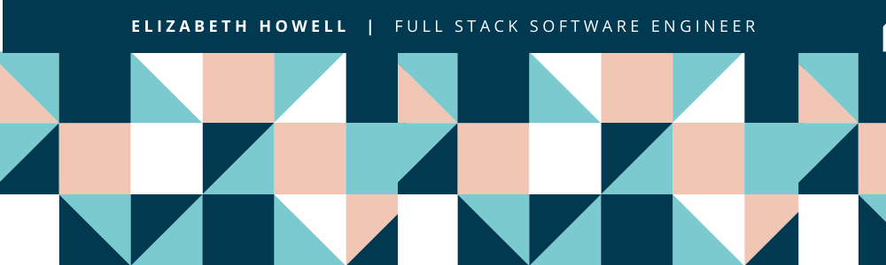

  Find me on <a href="https://www.linkedin.com/in/e-m-howell/">LinkedIn</a>

## Projects

<table bordercolor="#66b2b2">
  <tr>
  <td width="33%" valign="top">
      <h3>UniWeb Access</h3>
         
        
<a href="https://github.com/uniwebaccess/Capstone">Repo</a> | <a href="http://uniweb-access.herokuapp.com/">Site</a> | <a href="https://www.youtube.com/watch?v=UISfCtOx6Hc&ab_channel=FullstackAcademy">Video</a> 

         
            
        
Shocked by how few websites are actually accessible to users with disabilities, my team was inspired to create a web application that, given a URL, scans the webpage and returns feedback about its accessibility and suggestions for improvement.

    </td>
    <td width="33%" valign="top">
      <h3>Toy Stories</h3>
         
        
<a href="https://github.com/Super-Smart-Strawberries/graceshopper">Repo</a> | <a href="https://toystories.herokuapp.com/toys">Site</a>

         
            
        
Toy Stories is a mock e-commerce website that sells desk buddies to help you with the rubber-duck debugging method.

    </td>
  </tr>
</table>
<table>
<tr>
  <td width="33%" valign="top">
      <h3>Flyght v.1</h3>
         
        
<a href="https://github.com/bethhowell123/FlyghtOne">Repo</a> | <a href="https://youtu.be/zuqOMBNFPuE">Video</a>

         
        
       
Flyght allows the user to visualize their past flights on an interactive map.

    </td>
  <td width="33%" valign="top">
      <h3>Flyght v.2</h3>
         
        
<a href="https://github.com/bethhowell123/FlyghtTwo">Repo</a> | <a href="https://youtu.be/QAnEd0gfSFg">Video</a>

         
          
        
A work in progress! Originally a hackathon-style project to re-work Flyght v.1 into a more dynamic site with better UI/UX.

    </td>
  </tr>
</table>
